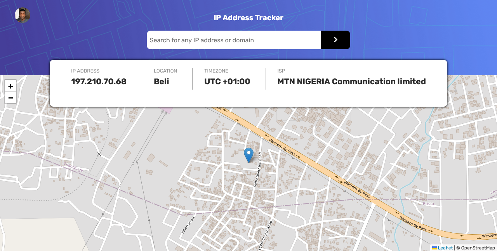

# Frontend Mentor - IP address tracker solution

This is a solution to the [IP address tracker challenge on Frontend Mentor](https://www.frontendmentor.io/challenges/ip-address-tracker-I8-0yYAH0). Frontend Mentor challenges help you improve your coding skills by building realistic projects. 

## Table of contents

- [Overview](#overview)
  - [The challenge](#the-challenge)
  - [Screenshot](#screenshot)
  - [Links](#links)
- [My process](#my-process)
  - [Built with](#built-with)
  - [What I learned](#what-i-learned)
  - [Continued development](#continued-development)
  - [Useful resources](#useful-resources)
- [Author](#author)


## Overview
This was a step up for me compared to my previous projects because I had to make use of 2 external APIs; the opensource leaflet Api which allowed me to easily generate the map and the IpWhois.io Api which allowed me to retrieve data concerning a users Ip information, including their network provider, timezone and location. I made use of javascript ES6 syntactic object oriented programming properties which gave me a good understandin of how classes and objects work, I also made use of the fetch API to retrieve data from the Ipwhois Api.

### The challenge

Users should be able to:

- View the optimal layout for each page depending on their device's screen size
- See hover states for all interactive elements on the page
- See their own IP address on the map on the initial page load
- Search for any IP addresses or domains and see the key information and location

### Screenshot




### Links

- Solution URL: [My solution](https://your-solution-url.com)
- Live Site URL: [The live site](https://joshuaaj003.github.io/Frontend-mentor-ip-geolocator-api-challenge/)

## My process
- I first built the basic structure with Html trying to make it as accesibility friendly as I could
- I then used SASS to style the site with different breakpoints for responsiveness
- I used plain vanilla javascript for the basic html DOM manipulation and used the leadlet and ipwhois api for the map and ip information retrieval
### Built with

- Semantic HTML5 markup
- CSS custom properties
- SASS
- Flexbox
- CSS Grid
- Mobile-first workflow
- Vanilla Javascript
- fetch Api


### What I learned

I learned how to use the fetch api and promises to retrieve and use data from a given url

```js
 async getIpInfo(){
            let responseData;

            if(this.ip==undefined){
      
  //        
                const ipInfo=await fetch(`https://ipwho.is`);
             responseData=ipInfo.json();

                return responseData;
            }
            const ipInfo=await fetch(`https://ipwho.is/${this.ip}`);
             responseData=ipInfo.json();
            return responseData;
      
        }

```


### Continued development

I would like to practice and develope more on how to fetch data from an API either using fetch or XMLHTTP requests, and to also get used to writing javascript Asynchronously


### Useful resources

- [leaflet.js](https://leafletjs.com) - This is the website that provided the api that was used to generate the interactive map, their documentation was easy to understand and well concise.
- [IPWHOIS](https://ipwhois.io) - I used the api from this website to retrieve the ip address info because although the original api suggested by frontend mentor ([ipify](https://geo.ipify.org))was easy to use and understand, it had a smaller window of limited requests for their free plan and I found my self needing more in other to properly test the site, and that's when i found IPWHOIS the number of requests for their free plan was 10,000 unlike the smaller 1000 requests offered by the ipify API, also note that IPWHOIS does not require an API key for their free plan but ipify does. 

## Author

- Website - [my linkedin](https://www.linkedin.com/in/joshua-ajorgbor-b0bba6227/)
- Frontend Mentor - [@yourusername](https://www.frontendmentor.io/profile/joshuaAj003)
- Twitter - [@yourusername](https://www.twitter.com/joshuaAj003)


## Acknowledgments

This is where you can give a hat tip to anyone who helped you out on this project. Perhaps you worked in a team or got some inspiration from someone else's solution. This is the perfect place to give them some credit.

**Note: Delete this note and edit this section's content as necessary. If you completed this challenge by yourself, feel free to delete this section entirely.**
